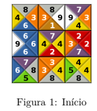
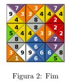

# Paradigma de Programação Lógica e Funcional

Dentro deste repositório está contido dois trabalhos desenvolvidos durante a matéria de PPLF no curso de Ciências da Computação - UEM

## Classificação no Brasileirão

O primeiro trabalho foi desenvolvido em na linguagem funcional Racket, a especificação está descrita abaixo:

No campeonato Brasileiro de Futebol, também chamado de Brasileirão, diversos times disputam o título de melhor time do Brasil.

Os times jogam todos contra todos em dois turnos, ida e volta, e vão acumulando pontos. Cada vitória gera
três pontos, cada empate um ponto e a derrota não gera pontos. Os times são classificados de acordo com
o seu desempenho, de forma que o time que tem melhor desempenho fica na frente do time que tem menos
pontos. O desempenho é determinado primeiramente pelo número de pontos, se dois ou mais times tem o
mesmo número de pontos, então, os seguintes critérios são utilizados para o desempate: número de vitórias,
saldo de gols (número de gols feito menos o número de gols sofridos) e ordem alfabética (Sim, é injusto! Mas
essa é uma simplificação...).

O objeito foi **Projetar uma Função** que recebe como entrada uma lista de strings que descreve os resultados dos jogos e produza uma lista de strings com a classificação dos times. Onde cada string da lista de entrada tem o resultado de um jogo escrito da forma “Anfitrião Gols Visitante Gols”
(os nomes dos times anfitrião e visitante não têm espaço). Por exemplo, a linha “Sao-Paulo 3 Flamengo 1”,
descreve o jogo em que o Sao-Paulo era anfitrião e marcou 3 gols e o Flamengo era visitante e marcou 1 gol.

Supondo que a lista de entrada seja:

(list "Sao-Paulo 1 Atletico-MG 2"

"Flamengo 2 Palmeiras 1"

"Palmeiras 0 Sao-Paulo 0"

"Atletico-MG 1 Flamengo 2")

O programa produz a seguinte lista de strings (uma string por linha) de saída

(list "Flamengo 6 2 2"

"Atletico-MG 3 1 0"

"Palmeiras 1 0 -1"

"Sao-Paulo 1 0 -1")

Onde depois do nome do time aparece o número de pontos, o número de vitórias e o saldo de gols.

Dentro da pasta é fornecido um arquivo txt dos jogos para o teste, para compilar utilize o comando:

```
$racket <arquivo>.rkt < jogos.txt
```

## Resolvedor de jogo de quebra-cabeça

O segundo trabalho foi desenvovido na linguagem lógica ProLog, a especificação do trabalho é a seguinte:

Em um jogo de quebra-cabeça de correspondência de borda é dado uma grade de blocos, onde cada bloco
tem um número em cada borda. O objetivo é colocar cada bloco em uma posição apropriada. Um bloco
está em uma posição apropriada se os blocos adjacentes (acima, a direita, abaixo e a esquerda) tem o mesmo
valor nas bordas adjacentes. Por exemplo, a figura abaixo mostra um jogo inicial com 3 linhas e 3 colunas



O jogador deve organizar os blocos de maneira que eles fiquem em posições apropriadas, como por exemplo



O objetivo do trabalho foi projetar um predicado **jogo_solucao(+Jogo, ?Solucao)** que é verdadeiro se **Solucao** é uma solução para o **Jogo**

Dentro do código tem testes, para executar os testes diretamente você pode usar o comando:

```
$swipl -g 'run_tests(pequeno)' -t halt jogo.pl # executa o conjunto de testes pequeno

$swipl -g run_tests -t halt jogo.pl #executa todos os testes
```
